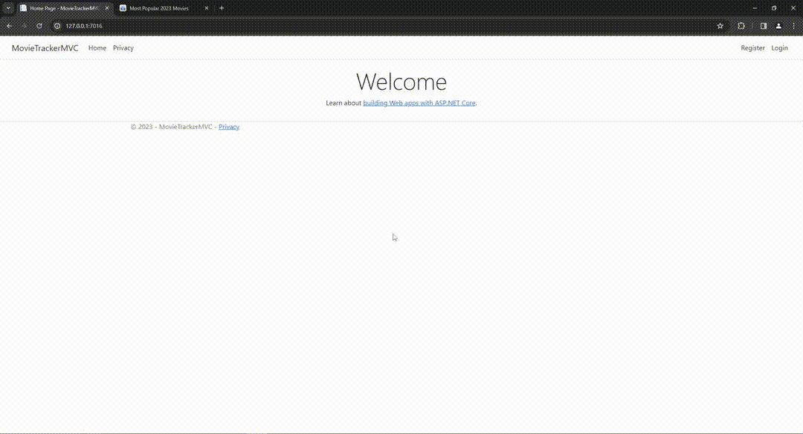

# About
I use this repository to learn and practice web development. Most of them are found on [github pages](https://m4ryu5.github.io/web-dev-practice/).

## [📁 pagination_practice](./src/pagination_practice)
- [☁ _Website_](https://m4ryu5.github.io/web-dev-practice/pagination_practice/pagination.html)
- ___HTML___ and ___CSS___ pagination footers created both from scratch and by following specific designs.
  

## [📁 chat_preview](./src/chat_preview)
- [☁ _Website_](https://m4ryu5.github.io/web-dev-practice/chat_preview)
- Twitch chat with customizable text-to-speech functionality. Built to improve my ___JavaScript___ skills.

## [📁 store_front_react](./src/store_front_react)
- [☁ _Website_](https://m4ryu5.github.io/web-dev-practice/store_front_react)
- A minimalist e-commerce front-end website featuring mock products from [dummyJSON](https://dummyjson.com/), a responsive shopping cart backed by localStorage, and support for both light and dark theme preferences. The main purpose for building this website was to test my [___React___](https://react.dev/learn) knowledge, but in this process, I also learned about:
  - [___Tailwind___](https://tailwindcss.com/docs/installation): Really good alternative to CSS. (Note: Even though the lines were getting longer, I didn’t find it annoying).
  - [___DaisyUI___](https://daisyui.com/docs/install/): A component library for _Tailwind_; good for rapid development and theming of the site.
  - ___JSX___ used by [___React___](https://react.dev/learn) to build components.
  - ___TypeScript___.

  

## [📁 movie_tracker](./src/movie_tracker)
- A site where you can track any media you want, from movies, serials to books or anime. The user selects the media he wants to track from a list managed by the site's administrator. Main reason for creating this site was to get confortable with .Net tooling, like:
  - [___ASP .Net Core 8 MVC__](https://learn.microsoft.com/en-us/aspnet/core/mvc/overview?view=aspnetcore-8.0): Used to build the actual site.
  - [Razor](https://learn.microsoft.com/en-us/aspnet/core/razor-pages/?view=aspnetcore-8.0&tabs=visual-studio): For Identity, created by Scaffolded tool then edited to fit my needs.
  - [___Minimal API___](https://learn.microsoft.com/en-us/aspnet/core/mvc/views/razor?view=aspnetcore-8.0): In this project I've used it to make a storage API for covers.
  - [Bootstrap 5](https://getbootstrap.com/docs/5.0/getting-started/introduction/): Front end toolkit for faster development (_prefer Tailwind_).
  - [___Entity Framework Core___](https://learn.microsoft.com/en-us/ef/core/): O/RM (object-relational mapper). Used to buld the database structure, that I've described in an [_Excalidraw_](https://excalidraw.com/) document in [docs](./src/movie_tracker/docs/), and handle the communication with database.
  - [Datatables](https://datatables.net/): Front end library used to draw responsive tables. I've used it with custom back end API for data fetching.
  - __And__: _HTML_, _CSS_, _JavaScript_.
- Note: I don't think I can learn much more from this project, so I'm going to stop its development. As of now: 
  - authentication is working, with 2FA;
  - the administrator can add new media with cover images; 
  - images can be drag & drop, pasted from clipboard or selected from computer;
  - covers are saved on a diferent machine, using Minimal API as interface;
  - debug tooling: _docker compose_ for VS and multiple _tasks_ and _launch settings_ for _vsCode_.

  
